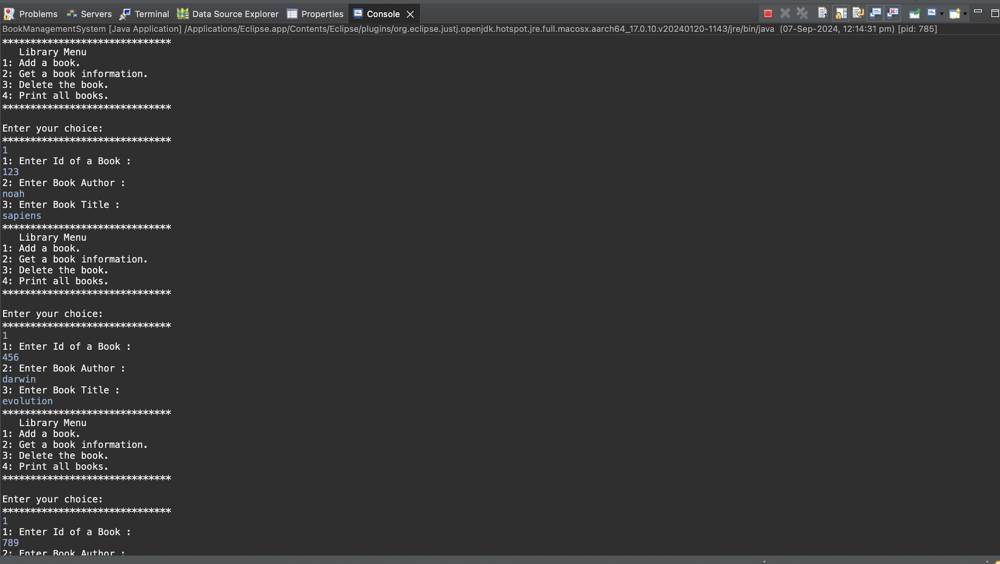
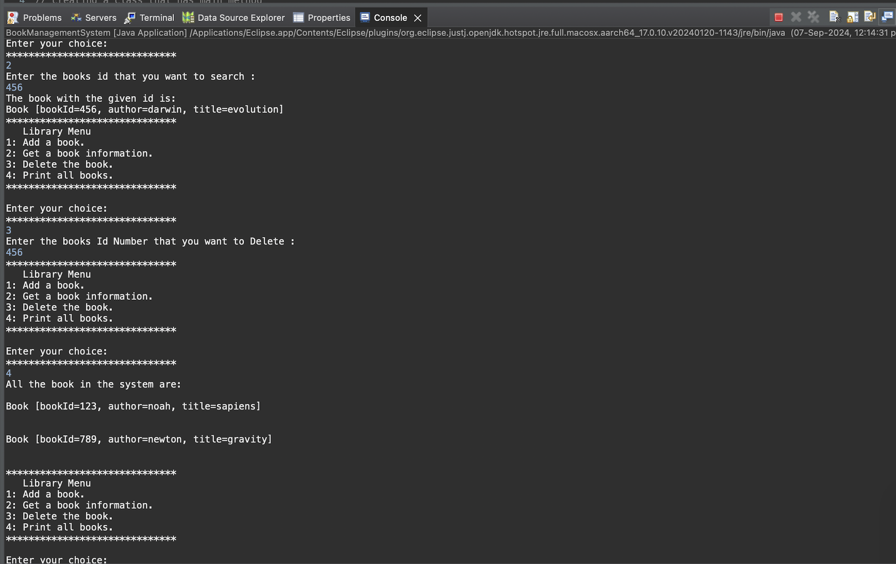
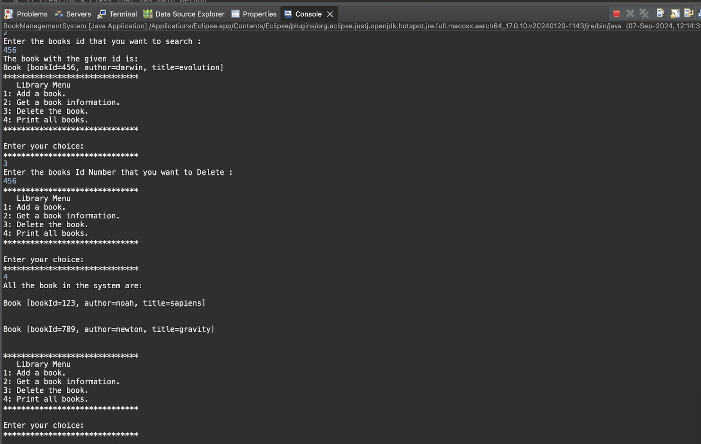

# Java OOP Interfaces, Abstraction & Class Relationships


This repository contains Java programs demonstrating essential Object-Oriented Programming (OOP) concepts such as **encapsulation, abstraction, interfaces, and class relationships**. The project is organized into **two major tasks**:

1. **Library Management System**
2. **Taxable Interface Implementation**

---

## 📁 Project Structure

```
java-oop-interfaces-abstraction/
│
├── .github/workflows/
│   └── java-build.yml
│
├── screenshots/
│   ├── 1.a.png
│   ├── 1.b.png
│   ├── 1.c.png
│   ├── 1.d.png
│   └── 2.png
│
├── src/
│   ├── Book.java
│   ├── BookManagementSystem.java
│   ├── Employee.java
│   ├── Library.java
│   ├── Main.java
│   ├── Product.java
│   └── Taxable.java
│
├── LICENSE
└── README.md

```

### File Overview
- **Book.java** – Defines the `Book` class with attributes `bookID`, `title`, `author`, and `isAvailable`.
- **Library.java** – Manages an array of `Book` objects; methods to add, remove, search, and display books.
- **Taxable.java** – Interface defining constants `salesTax`, `incomeTax`, and abstract method `calcTax()`.
- **Employee.java** – Implements `Taxable` to compute income tax.
- **Product.java** – Implements `Taxable` to compute sales tax.
- **Main.java** – Driver for tax calculations.

---

# 📘 Task 1 — Library Management System

### Book Class
Represents:
- `bookID`
- `title`
- `author`
- `isAvailable`

### Library Class
Supports:
✔ Add books  
✔ Remove books  
✔ Search by ID  
✔ Display all books

### 📸 Screenshots
  
  
  


---

# 🧮 Task 2 — Taxable Interface Implementation

### Taxable Interface
Defines:
- `salesTax = 0.07`
- `incomeTax = 0.105`
- Abstract method `calcTax()`

### Employee Class
Computes **income tax** based on salary.

### Product Class
Computes **sales tax** based on price.

### 📸 Screenshot


---

# ▶️ Running the Programs

### Clone
```bash
git clone https://github.com/TheComputationalCore/java-oop-interfaces-abstraction.git
```

### Compile
```bash
javac *.java
```

### Run Task 1
```bash
java Library
```

### Run Task 2
```bash
java Main
```

---

# Requirements
- Java JDK 8+
- Terminal or IDE

---

# 📝 License
This project is licensed under the **MIT License**.
