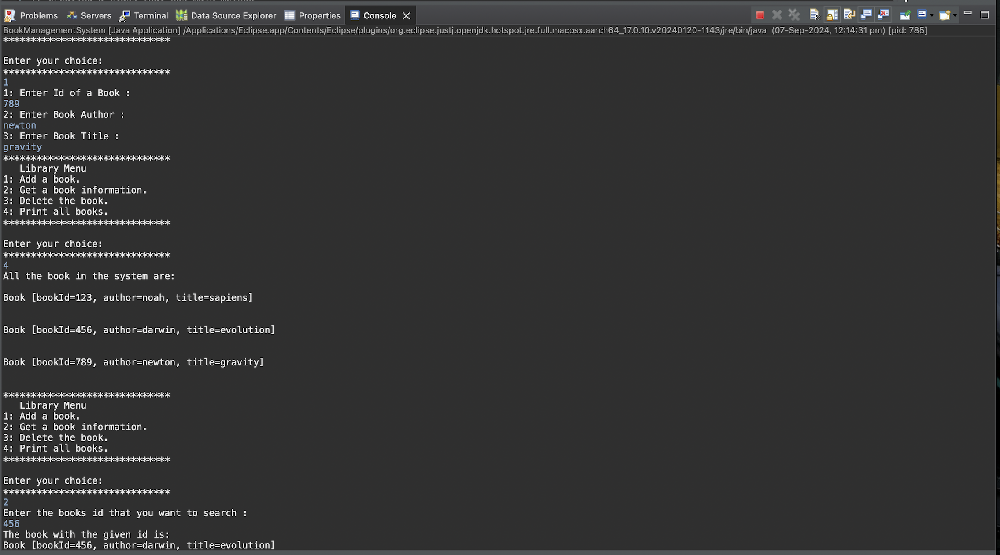

# Java OOP Interfaces, Abstraction & Class Relationships

🚀 **Master OOP with Real‑World Java Implementations**


This repository demonstrates essential **Object‑Oriented Programming (OOP)** concepts including  
**encapsulation**, **abstraction**, **interfaces**, and **class relationships** through two real-world tasks:

1. **Library Management System**  
2. **Taxable Interface: Employee & Product Tax Calculation**

---

## 📁 Project Structure

```
java-oop-interfaces-abstraction/
│
├── .github/workflows/
│   └── java-build.yml
│
├── screenshots/
│   ├── 1.a.png
│   ├── 1.b.png
│   ├── 1.c.png
│   ├── 1.d.png
│   └── 2.png
│
├── src/
│   ├── Book.java
│   ├── BookManagementSystem.java
│   ├── Employee.java
│   ├── Library.java
│   ├── Main.java
│   ├── Product.java
│   └── Taxable.java
│
├── LICENSE
└── README.md
```

---

# 📘 Task 1 — Library Management System

### **Book Class**
Represents:
- `bookID`
- `title`
- `author`
- `isAvailable`

### **Library Class**
Provides:
- ➕ Add books  
- ➖ Remove books  
- 🔍 Search by ID  
- 📋 Display all books  

### 📸 Screenshots (Task 1)
| 1.a | 1.b |
|-----|-----|
|  |  |

| 1.c | 1.d |
|-----|-----|
|  |  |

---

# 🧮 Task 2 — Taxable Interface Implementation

### **Taxable Interface**
Defines:
- `salesTax = 0.07`
- `incomeTax = 0.105`
- Method: `calcTax()`

### **Employee Class**
✔ Calculates **income tax** from salary.

### **Product Class**
✔ Calculates **sales tax** from price.

### 📸 Screenshot (Task 2)


---

# ▶️ How to Run

### **Clone Repository**
```bash
git clone https://github.com/TheComputationalCore/java-oop-interfaces-abstraction.git
```

### **Navigate**
```bash
cd java-oop-interfaces-abstraction/src
```

### **Compile**
```bash
javac *.java
```

### **Run Task 1**
```bash
java Library
```

### **Run Task 2**
```bash
java Main
```

---

# 🛠 Requirements
- Java **JDK 8+**
- Terminal / Command Prompt / IDE (IntelliJ, VS Code, Eclipse)

---

# 📝 License
Licensed under the **MIT License**.
